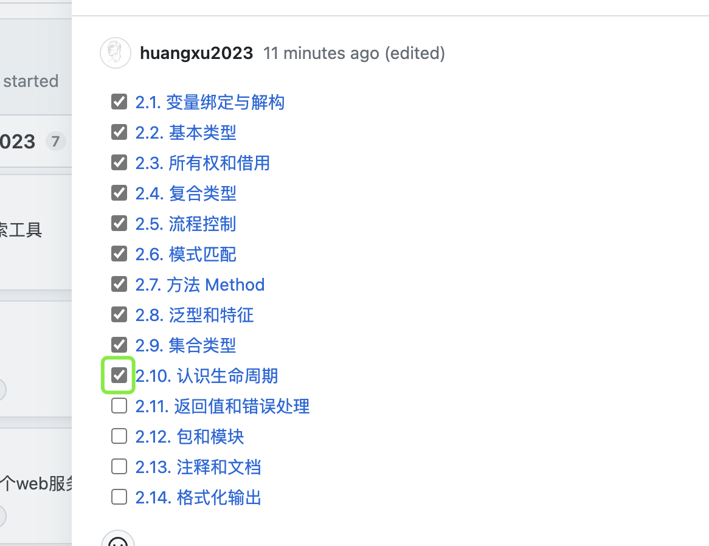

# RustLearning
## 本Repo用途
- 追踪成员学习进度，教材为[Rust语言圣经(Rust教程 Rust Course)](https://course.rs/about-book.html)
    - 只选取本教材的前俩模块：《Rust语言基础学习》、《Rust语言进阶学习》
    
- 讨论相关难点

## 进度看板
#### 如何访问
 - [Rust learning progress](https://github.com/orgs/RustCoreBoys/projects/2)
    
#### 如何使用 
- 我们大多数操作会集中于[Billborad视图](https://github.com/orgs/RustCoreBoys/projects/2/views/3)

- 每位成员都有一组属于自己的任务组
- 展开自己任务组，其中每一个条目都是一个issue，对应了[Rust语言圣经(Rust教程 Rust Course)](https://course.rs/about-book.html) 中的一个章节

- 展开单个issue，会有一个对应的本章Todo List。每个Todo Item 都对应着一个小节

- 每当进行一章时，将本章对应的issue状态设为**In Progress**，此时当前任务会被移至对应栏目

- 每当完成一个小节，请勾选当前小节对应的Todo Item

- 当整章完成时，可直接将本章的issue关闭，当前任务会被移至**Done** 栏目

#### 团队进度统计
- [成员学习进程](https://github.com/orgs/RustCoreBoys/projects/2/insights/1)

- [里程碑进程](https://github.com/orgs/RustCoreBoys/projects/2/insights/2)

## 讨论板块
#### 如何访问
- https://github.com/RustCoreBoys/RustLearning/discussions

